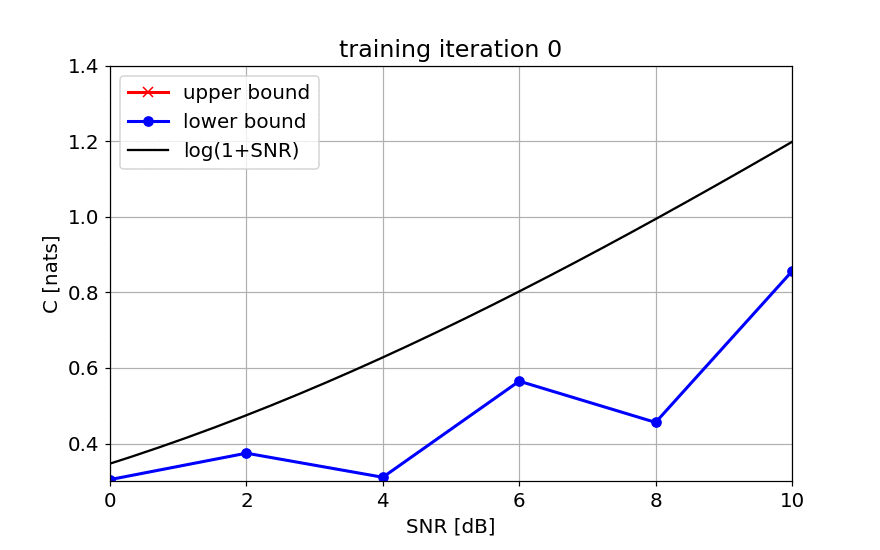

# Data-Driven Upper Bounds on Channel Capacity

This repository contains the source code to reproduce the numerical results in our paper [Data-Driven Upper Bounds on Channel Capacity](https://arxiv.org/abs/2205.06471). The code is written in Python/TensorFlow using Jupyter notebooks and can be found in the folder `code`. 

## Example

The following animation shows how the estimated upper bound (red curve) based on the proposed algorithm evolves as a function of the training iteration for the standard additive white Gaussian noise (AWGN) channel. The lower bound (blue curve) is based on the [2019 Paper by Fritschek, Schaefer, and Wunder](https://arxiv.org/abs/1903.02865), see also their [github repository](https://github.com/Fritschek/MINE-Mutual-Information-Neural-Estimator). The black curve is the ground-truth capacity. 

Note that the optimization (both for the upper and lower bound) is performed separately for each signal-to-noise ratio (SNR). 

## Additional information

Paper information: 

* C. Häger, E. Agrell, "[Data-Driven Upper Bounds on Channel Capacity](https://arxiv.org/abs/2205.06471)", under review, 2022

